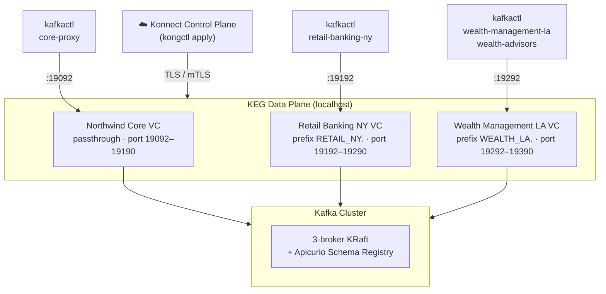

# Kong Event Gateway Examples — Northwind Financial

This repository contains progressive examples demonstrating Kong Event Gateway features using **kongctl** declarative configuration with Kong Konnect.

The examples follow **Northwind Financial**, a mid-size financial services firm with two business units — **Retail Banking NY** and **Wealth Management LA** — sharing a single Kafka cluster with no isolation, no auth, and no policy enforcement. Each example adds one governance layer to that cluster.

Each example is self-contained with its own `kongctl/config.yaml`. Examples are cumulative — each includes all configuration from prior phases plus the new feature.

## The Business Problem

> Northwind Financial runs a self-managed Kafka cluster that every service talks to directly.
> No tenant boundaries. No credential management. No data policies. As the firm opens new
> channels and onboards external partners, the infosec team realises their Kafka cluster is
> a flat, shared bus where any misconfigured consumer can read everything.
>
> This example set follows their journey: from raw, unprotected Kafka → to a fully governed
> event fabric managed by Kong Event Gateway — one phase at a time.

## Architecture Overview



## Prerequisites

- Docker and Docker Compose
- [kongctl](https://konghq.com/products/kong-konnect/event-gateway) CLI
- [kafkactl](https://deviceinsight.github.io/kafkactl/) (optional, for testing)
- A Kong Konnect account (free tier works)

## One-Time Bootstrap

### Step 1 — Start Kafka

```bash
docker compose -f kafka/docker-compose.yaml up -d
docker compose --profile init -f kafka/docker-compose.yaml up -d
```

### Step 2 — Register the Data Plane Certificate

Generate a self-signed certificate:

```bash
openssl req -new -x509 -nodes -newkey rsa:2048 \
  -subj "/CN=event-gateway/C=US" \
  -keyout kongctl/certs/key.crt \
  -out    kongctl/certs/tls.crt
```

Register it in Konnect:

```bash
export KONGCTL_DEFAULT_KONNECT_PAT=<your-personal-access-token>
kongctl apply -f kongctl/data_plane_certificate.yaml
```

Retrieve the cluster ID:

```bash
kongctl get event-gateway keg-examples-gateway --output json --jq '.id' --jq-raw-output
```

### Step 3 — Configure konnect.env

```bash
cp konnect.env.example konnect.env
```

Edit `konnect.env` with your region, domain, and cluster ID, then load the TLS identity:

```bash
printf 'KONG_KONNECT_CLIENT_CERT="%s"\n' "$(cat kongctl/certs/tls.crt)" >> konnect.env
printf 'KONG_KONNECT_CLIENT_KEY="%s"\n'  "$(cat kongctl/certs/key.crt)"  >> konnect.env
```

### Step 4 — Start the Gateway

```bash
docker compose up -d
```

## Examples (Cumulative Phases)

Apply them in order — each replaces the previous configuration with one that adds new capabilities:

| # | Directory | Feature |
|---|-----------|---------|
| 1 | [`examples/01-basic-proxy/`](examples/01-basic-proxy/README.md) | Backend cluster + flat passthrough VC |
| 2 | [`examples/03-topic-filter/`](examples/03-topic-filter/README.md) | Tenant isolation — Retail NY and Wealth LA namespaces |
| 3 | [`examples/04-auth-mediation/`](examples/04-auth-mediation/README.md) | SASL/PLAIN auth termination for Wealth Management |
| 4 | [`examples/05-acl-enforcement/`](examples/05-acl-enforcement/README.md) | Gateway-enforced ACLs with identity-based conditions |
| 5 | [`examples/06-encryption/`](examples/06-encryption/README.md) | Field-level encryption on wire transfer events |
| 6 | [`examples/07-schema-validation/`](examples/07-schema-validation/README.md) | Schema validation on fraud risk score topics |

Topic alias (CEL-based name rewriting) is documented as a concept reference in [`examples/02-topic-alias/`](examples/02-topic-alias/README.md).

## Testing with kafkactl

| Context | Port | Auth | Business Unit |
|---------|------|------|---------------|
| `default` | 9092 | None | Direct to Kafka (no gateway) |
| `core-proxy` | 19092 | Anonymous | Northwind Core — all topics visible |
| `retail-banking-ny` | 19192 | Anonymous | Retail Banking NY namespace |
| `wealth-management-la` | 19292 | Anonymous | Wealth Management LA (read-only via ACLs) |
| `wealth-advisors` | 19292 | SASL/PLAIN | Wealth Mgmt — elevated access incl. infosec |
| `wealth-advisors-schema` | 19292 | SASL/PLAIN + SR | Wealth Mgmt — with Schema Registry |

```bash
kafkactl config use-context core-proxy
kafkactl get topics
```

## Environment Variables

| Variable | Required | Description |
|----------|----------|-------------|
| `KONG_KONNECT_REGION` | Yes | Konnect region (us, eu, au) |
| `KONG_KONNECT_DOMAIN` | Yes | Konnect domain (konghq.com) |
| `KONG_KONNECT_GATEWAY_CLUSTER_ID` | Yes | Gateway cluster ID from Konnect |
| `KONG_KONNECT_CLIENT_CERT` | Yes | Data plane TLS certificate (PEM) |
| `KONG_KONNECT_CLIENT_KEY` | Yes | Data plane TLS private key (PEM) |
| `KAFKA_USERNAME` | Variant A1 | Confluent Cloud API key |
| `KAFKA_PASSWORD` | Variant A1 | Confluent Cloud API secret |
| `TRANSACTION_ENCRYPTION_KEY` | Examples 6-7 | Base64-encoded 32-byte encryption key |

## Directory Structure

```
kong-event-gw-examples/
├── docker-compose.yaml              # Gateway data plane
├── kafka/
│   ├── docker-compose.yaml          # Kafka cluster + Apicurio
│   └── config/
│       ├── topics.txt               # Northwind Financial topic list
│       └── schemas/
├── kongctl/
│   ├── certs/                       # TLS identity (gitignored)
│   └── data_plane_certificate.yaml
├── examples/
│   ├── 01-basic-proxy/
│   ├── 02-topic-alias/              # CEL concept reference
│   ├── 03-topic-filter/
│   ├── 04-auth-mediation/
│   ├── 05-acl-enforcement/
│   ├── 06-encryption/
│   ├── 07-schema-validation/
│   ├── A1-confluent-cloud/          # Confluent Cloud backend variant
│   └── A2-redpanda/                 # Redpanda backend variant
├── konnect.env.example
├── .kafkactl.yml
└── README.md
```

## Variants (Alternative Backends)

These replace the local Kafka backend entirely:

| Directory | Backend |
|-----------|---------|
| [`examples/A1-confluent-cloud/`](examples/A1-confluent-cloud/README.md) | Confluent Cloud (SASL/PLAIN + TLS) |
| [`examples/A2-redpanda/`](examples/A2-redpanda/README.md) | Redpanda |

## License

This project is licensed under the Apache License, Version 2.0. See [LICENSE](LICENSE) for the full license text.
