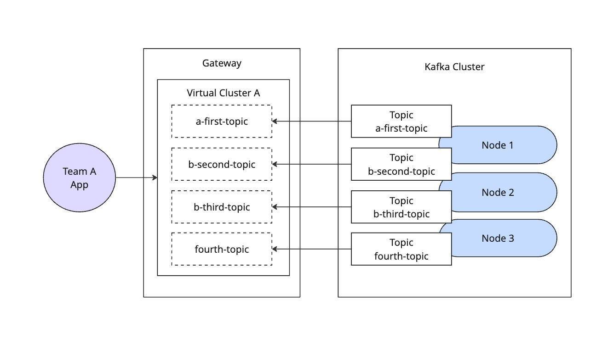

# Basic Kafka Proxy Example

This example demonstrates the basic proxy functionality of Kong Event Gateway, allowing clients to connect to a Kafka cluster through a proxy layer with anonymous authentication.

## Overview

The setup provides:
- Simple proxy configuration for Kafka
- Anonymous authentication
- Direct pass-through of Kafka operations
- No message transformation or additional processing



## Components

- Apache Kafka broker (localhost:9092)
- Kong Event Gateway proxy (localhost:19092)

## Quick Start

1. Start the services:
```bash
docker-compose up -d
```

2. Verify the services are running:
```bash
docker ps
```

You should see two containers running:
- `kafka`: The Apache Kafka broker
- `knep-docker`: The Kong Event Gateway proxy

## Configuration Details

The `config.yaml` file contains the minimal configuration needed for a Kafka proxy:

```yaml
backend_clusters:
  - name: kafka-localhost
    bootstrap_servers:
      - localhost:9092
      - localhost:9093
      - localhost:9094

virtual_clusters:
  - name: team-a
    backend_cluster_name: kafka-localhost
    route_by:
      type: port
      port:
        min_broker_id: 1
    authentication:
      - type: anonymous
        mediation:
          type: anonymous

listeners:
  port:
    - listen_address: 0.0.0.0
      listen_port_start: 19092
```

Key configuration points:
- Virtual cluster listening on port 19092
- Anonymous authentication for easy testing
- Direct routing to backend Kafka cluster

## Testing

Using kafkactl, you can test both direct and proxied connections:

1. Direct connection to Kafka:
```bash
kafkactl config use-context default
kafkactl create topic a-first-topic b-second-topic b-third-topic fourth-topic
kafkactl produce a-first-topic --value="Hello World"
```

2. Connection through proxy:
```bash
kafkactl config use-context virtual
kafkactl consume a-first-topic --from-beginning --exit
```

## Directory Structure

```
01-basic-proxy/
├── config.yaml           # Gateway configuration
├── docker-compose.yaml   # Service definitions
└── README.md            # This file
```

## Environment Variables

Required environment variables for Kong Event Gateway:
- `KONNECT_API_TOKEN`: Konnect API Token
- `KONNECT_API_HOSTNAME`: Konnect API Hostname (e.g., us.api.konghq.com)
- `KONNECT_CONTROL_PLANE_ID`: Konnect Control Plane ID

Make sure to set these in your environment or update the docker-compose.yaml file before starting the services.

## Use Cases

This basic proxy setup is ideal for:
- Learning and testing Kong Event Gateway
- Development environments
- Simple Kafka proxy needs
- Network segmentation scenarios

## Troubleshooting

Common issues:

1. Connection refused:
   - Verify all services are running (`docker ps`)
   - Check if ports are available (19092 for proxy, 9092 for Kafka)
   - Ensure KONNECT environment variables are set correctly

2. Topics not visible:
   - Verify Kafka broker is healthy
   - Check if you're using the correct kafkactl context
   - Ensure proxy is properly connected to the backend cluster

## Limitations

- No authentication (uses anonymous access)
- No message transformation
- No topic rewriting
- Basic networking setup (uses host network mode)

## Next Steps

After mastering this basic setup, explore other examples:
- Topic aliasing (02-topic-alias)
- Topic filtering (03-topic-filter)
- Authentication mediation (04-auth-mediation)
- Encryption (05-encryption)
- Schema validation (06-schema-validation)

## Related Documentation

- [Kong Event Gateway Documentation](https://docs.konghq.com/gateway/)
- [Kafka Documentation](https://kafka.apache.org/documentation/)

## Cleanup

When you're done experimenting with this example, you can clean up the resources:

1. Stop and remove the containers:
```bash
docker-compose down
```

2. Verify all containers have been removed:
```bash
docker ps -a | grep -E 'kafka|knep'
```

This will stop all services and remove the containers, but preserve your configuration files for future use.
