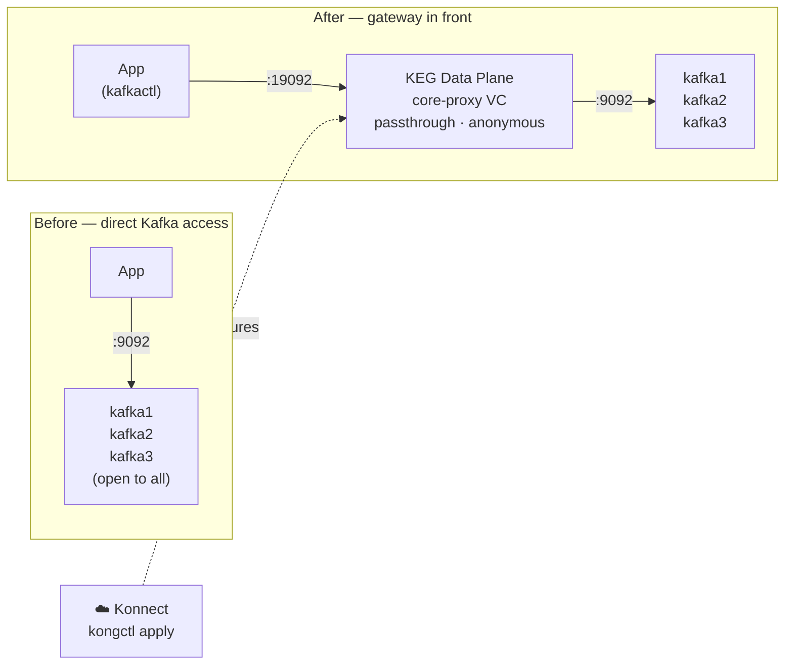

# Phase 1 — Basic Proxy

Northwind Financial's first step: put Kong Event Gateway in front of the Kafka cluster without touching a single broker config. The gateway acts as a transparent proxy — all topics are visible, no auth, no policies.

## Setup Diagram


```mermaid
flowchart LR
    subgraph before["Before — direct Kafka access"]
        A1["App"] -->|":9092"| K1["kafka1\nkafka2\nkafka3\n(open to all)"]
    end

    subgraph after["After — gateway in front"]
        A2["App\n(kafkactl)"] -->|":19092"| G["KEG Data Plane\ncore-proxy VC\npassthrough · anonymous"]
        G -->|":9092"| K2["kafka1\nkafka2\nkafka3"]
    end

    KC["☁️ Konnect\nkongctl apply"] -.->|configures| G
```

## What It Does

- Registers the 3-broker Kafka cluster as a backend in Konnect
- Creates a single flat passthrough virtual cluster (`core-proxy`)
- Exposes Kafka on ports 19092–19190 with anonymous authentication
- Gateway is transparent — clients see exactly what's on the broker

## How to Use

```bash
# Prerequisites: Kafka running, cert registered, konnect.env configured
# See root README for bootstrap instructions.

kongctl apply -f kongctl/config.yaml

kafkactl config use-context core-proxy
kafkactl get topics
kafkactl create topic nw.ops.test.hello-world.v1
kafkactl produce nw.ops.test.hello-world.v1 --value="Hello from Northwind via KEG!"
kafkactl consume nw.ops.test.hello-world.v1 --from-beginning --exit
```

## Key Concepts

- **Backend Cluster**: Defines the upstream Kafka brokers the gateway connects to
- **Listener**: A port range that clients connect to on the gateway
- **Virtual Cluster**: A tenant isolation unit; here it's a flat passthrough with no transformation
- **Port Mapping**: Routes traffic from a listener port range to a specific virtual cluster

## Testing

```bash
# Direct connection (bypasses gateway):
kafkactl config use-context default
kafkactl get topics

# Through the gateway proxy:
kafkactl config use-context core-proxy
kafkactl get topics
```

Both show the same topics — the gateway is fully transparent at this phase.

## Next

```bash
kongctl apply -f ../03-topic-filter/kongctl/config.yaml
```

Moves to Phase 2: tenant namespace isolation for Retail Banking NY and Wealth Management LA.
