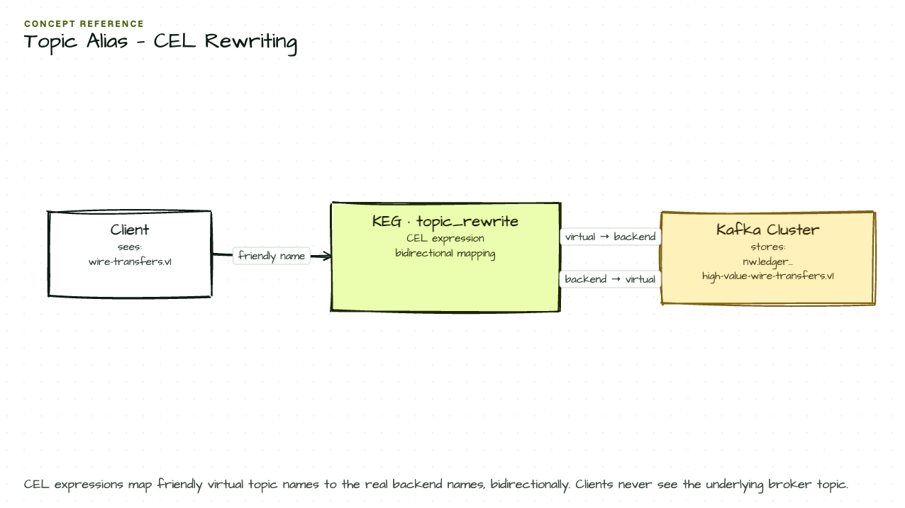

# Topic Aliases

> **Requires: Kong Event Gateway 1.2+**

Topic aliases let you expose backend Kafka topics under client-friendly names. Clients produce and consume using the alias; the gateway transparently routes to the real backend topic. This is useful when internal topics follow verbose naming conventions — like `nw.crm.advisory.prospect-locations.v1` — that you don't want to expose to external clients or partners.

This phase adds `topic_aliases` to the existing `core-proxy` virtual cluster from [Phase 1](../01-basic-proxy/README.md).

## Diagram



## What It Does

- Adds aliases `prospects` and `market-data` to the `core-proxy` virtual cluster
- Clients connecting to `core-proxy` can use either the alias or the full backend topic name
- Transparent to producers and consumers — no client-side changes required
- ACLs are evaluated on the name the client uses, before alias resolution

## Supported Operations

Aliases support produce, fetch, list offsets, consumer group operations, and `ListTopics`. Topic management operations (`CreateTopics`, `DeleteTopics`, `CreatePartitions`, etc.) are rejected with `InvalidTopicException` on aliases.

## How to Use

Topics are created during the Kafka bootstrap step — no manual setup needed.

```bash
# Apply the configuration
kongctl apply -f examples/02-topic-alias/kongctl/config.yaml

# List topics through core-proxy — you'll see both aliases and original names
kafkactl config use-context core-proxy
kafkactl get topics

# Expected output includes:
# market-data                                    3              3
# nw.analytics.forecasting.market-weather.v1     3              3
# nw.crm.advisory.prospect-locations.v1          3              3
# prospects                                      3              3

# Produce via alias
kafkactl produce prospects --value='{"prospect_id": "NW-P-44821", "region": "NY", "score": 82}'

# Consume from the real backend topic to verify the message arrived
kafkactl config use-context default
kafkactl consume nw.crm.advisory.prospect-locations.v1 --from-beginning --exit
# Output: {"prospect_id": "NW-P-44821", "region": "NY", "score": 82}
```

## Configuration Details

```yaml
virtual_clusters:
  - ref: core-proxy
    # ... existing config from phase 1 ...
    topic_aliases:
      - alias: prospects
        topic: nw.crm.advisory.prospect-locations.v1
      - alias: market-data
        topic: nw.analytics.forecasting.market-weather.v1
```

## ACL Behaviour

ACLs are evaluated on the name the client uses, **before** alias resolution. An ACL on the backend topic does not automatically grant access to its alias, and vice versa. With `acl_mode: enforce_on_gateway`, each alias must be granted access explicitly.

## Next

```bash
kongctl apply -f examples/03-topic-filter/kongctl/config.yaml
```

Adds namespace isolation — Retail NY and Wealth LA get their own prefixed virtual clusters.

## See Also

- [Topic Filter (namespace-based isolation)](../03-topic-filter/README.md)
- [Event Gateway Documentation](https://developer.konghq.com/event-gateway/)
- [Configure topic aliases](https://developer.konghq.com/event-gateway/configure-topic-aliases/)
