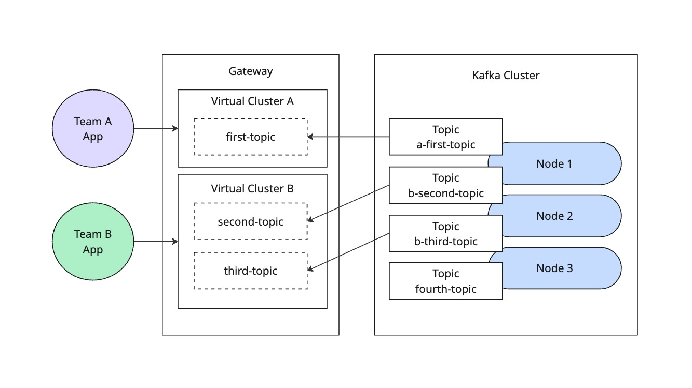

# Topic Filter Example

This example demonstrates how to configure Kong Event Gateway to automatically filter topic names using prefixes.

## Overview

The setup provides:
- Automatic topic name prefixing
- Prefix-based topic filtering
- Transparent operation for clients
- Anonymous authentication for easy testing



## Components

- Apache Kafka broker (localhost:9092)
- Kong Event Gateway proxy (localhost:19092 for team-a, localhost:29092 for team-b)

## Quick Start

1. Start the services:
```bash
docker-compose up -d
```

2. Verify the services are running:
```bash
docker ps
```

You should see two containers running:
- `kafka`: The Apache Kafka broker
- `knep`: The Kong Native Event Proxy

## Configuration Details

The `config.yaml` file demonstrates topic filtering configuration with multiple virtual clusters:

```yaml
virtual_clusters:
  - name: team-a
    backend_cluster_name: kafka-localhost
    route_by:
      type: port
      port:
        min_broker_id: 1
    authentication:
      - type: anonymous
        mediation:
          type: anonymous
    topic_rewrite:
      type: prefix
      prefix:
        value: a-
  - name: team-b
    backend_cluster_name: kafka-localhost
    route_by:
      type: port
      port:
        offset: 10000
        min_broker_id: 1
    authentication:
      - type: anonymous
        mediation:
          type: anonymous
    topic_rewrite:
      type: prefix
      prefix:
        value: b-
```

Key configuration points:
- Two virtual clusters with different prefixes: "a-" for team-a and "b-" for team-b
- Team-a accessible on port 19092, team-b on port 29092
- All topics accessed through each proxy will be prefixed accordingly
- Original topic names preserved in the client view
- Transparent prefix handling for clients

## Testing

Using kafkactl, test the topic filtering:

1. Create topics directly in Kafka:
```bash
kafkactl config use-context default
kafkactl create topic a-first-topic b-second-topic b-third-topic fourth-topic
```

2. Access team-a topics through the proxy:
```bash
kafkactl config use-context team-a
kafkactl get topics
# Should only see "first-topic" (without the "a-" prefix)
kafkactl produce first-topic --value="Hello from Team A"
kafkactl consume first-topic -b -e
```

3. Access team-b topics through the proxy:
```bash
kafkactl config use-context team-b
kafkactl get topics
# Should only see "second-topic" and "third-topic" (without the "b-" prefix)
kafkactl produce second-topic --value="Hello from Team B"
kafkactl consume second-topic -b -e
```

4. Verify the actual topic names in Kafka:
```bash
kafkactl config use-context default
kafkactl get topics
# Should see all topics with their prefixes: "a-first-topic", "b-second-topic", etc.
```

## Directory Structure

```
03-topic-filter/
├── config.yaml           # Gateway configuration
├── docker-compose.yaml   # Service definitions
└── README.md            # This file
```

## Environment Variables

Required environment variables (when not using local config):
- `KONNECT_CP_HOST`: Konnect Control Plane host
- `KONNECT_PAT`: Personal Access Token

## Use Cases

This topic filter setup is ideal for:
- Multi-tenant environments
- Topic namespace isolation
- Environment segregation
- Service mesh patterns

## Troubleshooting

Common issues:

1. Topics not appearing with prefix:
   - Verify the proxy configuration is loaded correctly
   - Ensure you're connecting through the correct proxy port (19092 for team-a, 29092 for team-b)
   - Check if topic filter rules are correctly configured

2. Cannot access original topic names:
   - This is expected - always use unprefixed names through the proxy
   - Direct Kafka access will show prefixed names

3. Topics not visible to a team:
   - Each team can only see topics with their respective prefix
   - Team-a can only see topics prefixed with "a-"
   - Team-b can only see topics prefixed with "b-"
   - Topics without the correct prefix (like "fourth-topic") won't be visible through either proxy

## Limitations

- Single prefix per virtual cluster
- No regex-based filtering
- No conditional prefixing
- Prefix cannot be changed dynamically

## Next Steps

Explore other examples:
- Basic Proxy (01-basic-proxy)
- Topic Alias (02-topic-alias)
- Authentication Mediation (04-auth-mediation)
- Encryption (05-encryption)
- Schema Validation (06-schema-validation)

## Related Documentation

- [Kong Event Gateway Documentation](https://docs.konghq.com/gateway/)
- [Kafka Documentation](https://kafka.apache.org/documentation/)

## Cleanup

When you're done experimenting with this example, you can clean up the resources:

1. Stop and remove the containers:
```bash
docker-compose down
```

2. Verify all containers have been removed:
```bash
docker ps -a | grep -E 'kafka|knep'
```

This will stop all services and remove the containers, but preserve your configuration files for future use.
