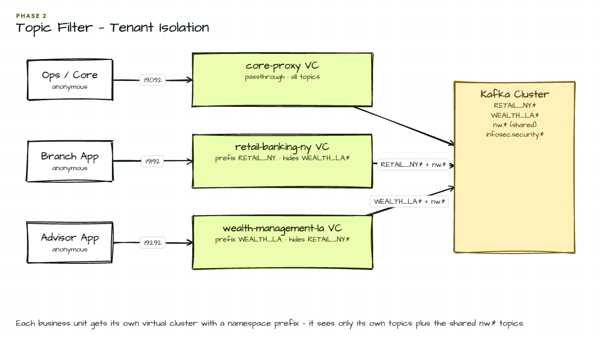

# Phase 2 — Tenant Isolation: Retail Banking NY and Wealth Management LA

Northwind Financial's two business units have been stepping on each other's consumer groups. Retail branch apps occasionally drift into Wealth topics because all services share the same bootstrap servers. This phase puts each business unit behind its own virtual cluster with a namespace prefix — they can only see their own topics.

## Setup Diagram



## What It Does

- Two virtual clusters with namespace prefix isolation
- **retail-banking-ny** (ports 19192–19290): prefix `RETAIL_NY.` — Retail branch services
- **wealth-management-la** (ports 19292–19390): prefix `WEALTH_LA.` — Wealth advisory services
- Shared `nw.*` topics injected into both views via `additional.topics`
- Each business unit sees only its own topics — cross-unit topics are invisible

## How to Use

```bash
kongctl apply -f kongctl/config.yaml

# Retail Banking NY view:
kafkactl config use-context retail-banking-ny
kafkactl get topics
# → payments.card-dispatch.v1, markets.exchange-ticker.v1, nw.*, ...

# Wealth Management LA view:
kafkactl config use-context wealth-management-la
kafkactl get topics
# → clients.sentiment-signals.v1, advisor.daily-client-activity.v1, nw.*, ...
```

## Configuration Details

The namespace block strips the prefix transparently for clients:

```yaml
virtual_clusters:
  - ref: retail-banking-ny
    namespace:
      mode: hide_prefix
      prefix: "RETAIL_NY."
      additional:
        topics:
          - type: glob
            glob: "nw.*"
    authentication:
      - type: anonymous
```

The prefix is automatically stripped on consume and added on produce. Clients never see `RETAIL_NY.` — the gateway handles the translation.

## Next

```bash
kongctl apply -f ../04-auth-mediation/kongctl/config.yaml
```

Moves to Phase 3: Wealth Management advisors authenticate with SASL/PLAIN at the gateway.
