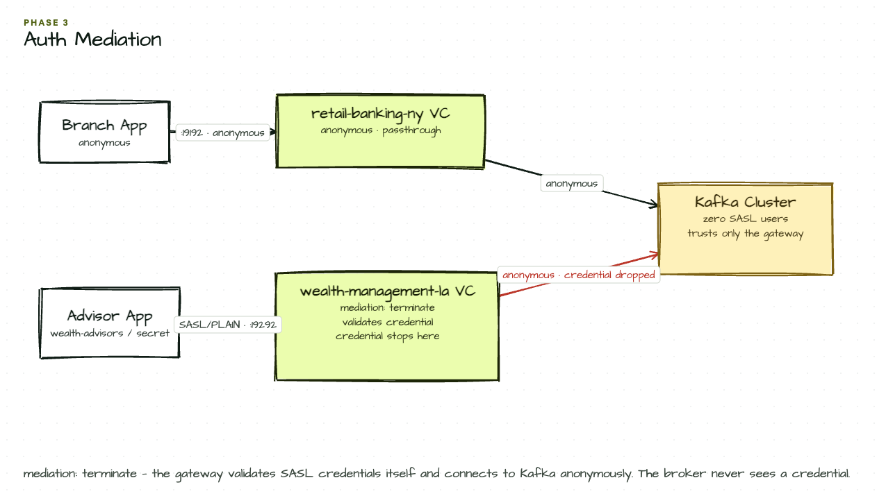

# Phase 3 — Auth Mediation: Credentials at the Edge

The Wealth Management team wants to lock down their virtual cluster so only credentialed advisors can connect. But they can't add SASL users to the Kafka cluster — that requires broker admin access and a change freeze window. With `mediation: terminate`, the gateway validates credentials itself and connects to Kafka anonymously. Kafka never sees the credentials.

## Setup Diagram



## What It Does

- Retail Banking NY stays anonymous (internal systems use network-level trust)
- Wealth Management LA requires SASL/PLAIN (`wealth-advisors` / `secret`)
- `mediation: terminate` — credentials are validated at the gateway, never forwarded to Kafka
- Kafka remains in anonymous mode; the gateway is the only entity it trusts

## How to Use

```bash
kongctl apply -f kongctl/config.yaml

# Wealth Management — authenticated access:
kafkactl config use-context wealth-advisors
kafkactl get topics

# Retail Banking NY — still anonymous:
kafkactl config use-context retail-banking-ny
kafkactl get topics
```

## Configuration Details

```yaml
virtual_clusters:
  - ref: wealth-management-la
    authentication:
      - type: sasl_plain
        mediation: terminate        # credentials stop here; Kafka never sees them
        principals:
          - username: wealth-advisors
            password: secret
```

### Auth Mediation Modes

- **terminate**: Gateway validates credentials, then connects to Kafka anonymously
- **forward**: Gateway forwards credentials to Kafka for backend validation
- **use_backend_cluster**: Gateway uses the backend cluster's own authentication config

## Next

```bash
kongctl apply -f ../05-acl-enforcement/kongctl/config.yaml
```

Moves to Phase 4: gateway-enforced ACLs — anonymous connections get read-only access, `wealth-advisors` gets full access including infosec topics.
