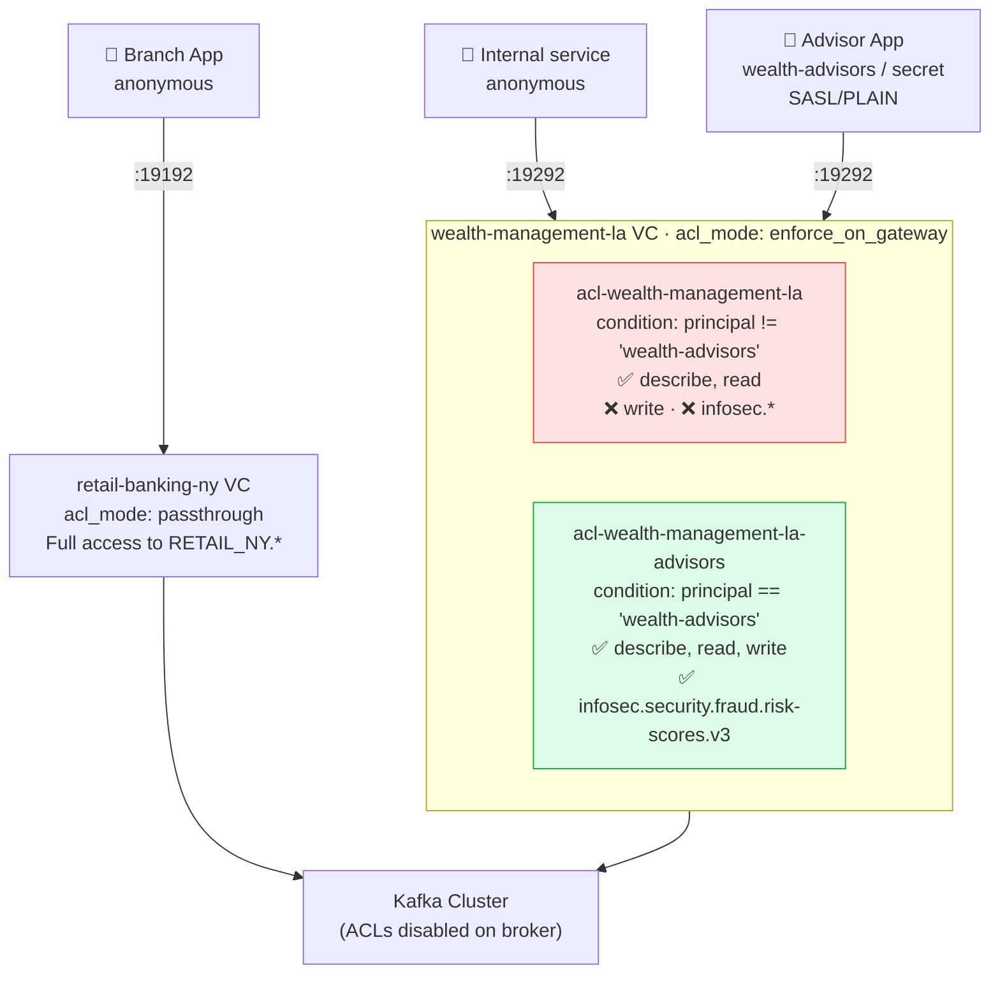

# Phase 4 — ACL Enforcement: Identity-Based Access Control

The infosec team wants to lock down who can produce to sensitive topics and prevent anonymous connections from writing to the Wealth Management cluster at all. With `acl_mode: enforce_on_gateway`, ACL rules are evaluated on the gateway — the broker stops evaluating them entirely. Rules can reference the authenticated identity, enabling conditional logic that Kafka ACLs simply can't express.

## Setup Diagram



## What It Does

- Retail Banking NY stays in `passthrough` mode — no ACL change, full anonymous access
- Wealth Management LA switches to `enforce_on_gateway` — the broker no longer evaluates ACLs
- Anonymous connections: read-only (describe + read topics, read consumer groups)
- `wealth-advisors`: full access including sensitive infosec fraud risk topics
- Conditions use CEL expressions against `context.auth.principal.name` — expressible with JWT claims too

## How to Use

```bash
kongctl apply -f kongctl/config.yaml

# Anonymous — read-only (can list but not produce):
kafkactl config use-context wealth-management-la
kafkactl get topics                                    # works
kafkactl produce clients.sentiment-signals.v1 --value='{"test":1}'   # denied

# wealth-advisors — full access including infosec:
kafkactl config use-context wealth-advisors
kafkactl get topics                                    # works
kafkactl produce clients.sentiment-signals.v1 --value='{"advisor":"test"}'  # works
kafkactl consume infosec.security.fraud.risk-scores.v3 --from-beginning      # works
```

## Configuration Details

```yaml
virtual_clusters:
  - ref: wealth-management-la
    acl_mode: enforce_on_gateway

    cluster_policies:
      - ref: acl-wealth-management-la
        type: acls
        condition: "context.auth.principal.name != 'wealth-advisors'"
        config:
          rules:
            - action: allow
              resource_type: topic
              operations: [describe, read]
              resource_names:
                - match: "*"
            - action: allow
              resource_type: group
              operations: [read]
              resource_names:
                - match: "*"

      - ref: acl-wealth-management-la-advisors
        type: acls
        condition: "context.auth.principal.name == 'wealth-advisors'"
        config:
          rules:
            - action: allow
              resource_type: topic
              operations: [describe, read, write]
              resource_names:
                - match: "*"
            - action: allow
              resource_type: group
              operations: [describe, read, write, create]
              resource_names:
                - match: "*"
```

The `condition` field is a CEL expression. The same pattern works with JWT claims: `context.auth.claims.role == 'senior-advisor'`.

## Access Summary

| Identity | ACL Mode | Topics | Write? |
|----------|----------|--------|--------|
| Retail (anonymous) | passthrough | RETAIL_NY.* + nw.* | Yes |
| Wealth (anonymous) | enforce_on_gateway | WEALTH_LA.* (no infosec) | No |
| wealth-advisors | enforce_on_gateway | WEALTH_LA.* + infosec.* | Yes |

## Next

```bash
export TRANSACTION_ENCRYPTION_KEY=$(openssl rand -base64 32)
kongctl apply -f ../06-encryption/kongctl/config.yaml
```

Moves to Phase 5: field-level encryption on high-value wire transfer events.
