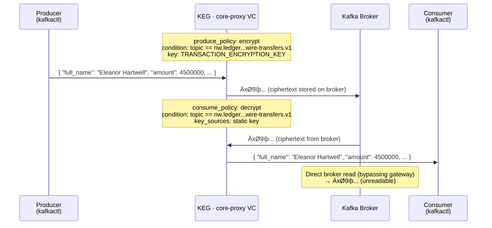

# Phase 5 — Field-Level Encryption: Wire Transfers

Northwind Financial's compliance team has flagged that high-value wire transfer events land on the Kafka broker as plaintext. Anyone with broker-level access can read them. This phase adds transparent produce/consume encryption on the `nw.ledger.transactions.high-value-wire-transfers.v1` topic — the gateway encrypts on produce and decrypts on consume. Producers and consumers change nothing.

## Setup Diagram



## What It Does

- Automatic encryption of wire transfer message values during produce
- Automatic decryption during consume — clients receive plaintext transparently
- Static encryption key loaded from `TRANSACTION_ENCRYPTION_KEY` environment variable
- Policy fires only on the wire transfer topic (condition-gated)
- All other topics unaffected

## How to Use

```bash
export TRANSACTION_ENCRYPTION_KEY=$(openssl rand -base64 32)

kongctl apply -f kongctl/config.yaml

# Produce a wire transfer event through the gateway (encrypted at the edge):
kafkactl config use-context core-proxy
kafkactl produce nw.ledger.transactions.high-value-wire-transfers.v1 \
  --value='{"transaction_id":"TXN-20240612-001","customer_id":"NW-C-88421","full_name":"Eleanor Hartwell","amount":4500000}'

# Consume through the gateway (decrypted transparently):
kafkactl consume nw.ledger.transactions.high-value-wire-transfers.v1 \
  --from-beginning --exit

# Read raw bytes directly from Kafka (bypassing gateway) — shows ciphertext:
docker exec -it kafka_cluster-kafka1-1 /opt/kafka/bin/kafka-console-consumer.sh \
  --bootstrap-server kafka1:9092 \
  --topic nw.ledger.transactions.high-value-wire-transfers.v1 \
  --from-beginning --max-messages 1
```

## Configuration Details

```yaml
static_keys:
  - ref: transaction-encryption-key
    value: !env TRANSACTION_ENCRYPTION_KEY

virtual_clusters:
  - ref: core-proxy
    produce_policies:
      - ref: wire-transfer-encryption-policy
        type: encrypt
        condition: 'context.topic.name == "nw.ledger.transactions.high-value-wire-transfers.v1"'
        config:
          failure_mode: error
          part_of_record:
            - value
          encryption_key:
            type: static
            key:
              id: !ref transaction-encryption-key

    consume_policies:
      - ref: wire-transfer-decryption-policy
        type: decrypt
        condition: 'context.topic.name == "nw.ledger.transactions.high-value-wire-transfers.v1"'
        config:
          failure_mode: error
          part_of_record:
            - value
          key_sources:
            - type: static
              key:
                id: !ref transaction-encryption-key
```

## Key Concepts

- **Static Key**: Loaded from an environment variable at gateway startup — never touches the broker
- **Produce Policy**: Applied to messages before they reach Kafka
- **Consume Policy**: Applied to messages on the way out to the consumer
- **failure_mode: error**: Reject the operation if encryption/decryption fails (rather than pass through)
- **part_of_record: [value]**: Only the message value is encrypted; key and headers remain plaintext

## Next

```bash
export TRANSACTION_ENCRYPTION_KEY=$(openssl rand -base64 32)
kongctl apply -f ../07-schema-validation/kongctl/config.yaml
```

Moves to Phase 6: schema validation on fraud risk score topics.
