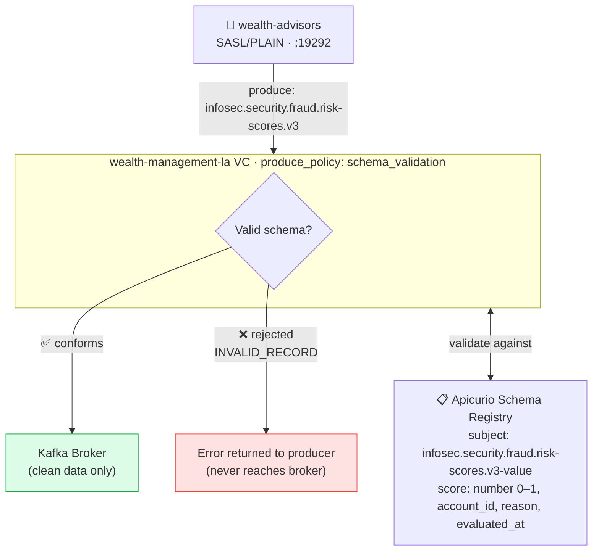

# Phase 6 — Schema Validation: Fraud Risk Scores

A bad deploy last quarter pushed malformed JSON to the fraud risk score topic and poisoned a downstream ML model's training set. This phase registers Apicurio Schema Registry with the gateway and enforces a JSON Schema contract on `infosec.security.fraud.risk-scores.v3`. Malformed messages are rejected at the gateway before they ever reach the broker — the ML pipeline is protected without any producer-side changes.

## Setup Diagram



## What It Does

- Registers Apicurio Schema Registry (Confluent-compatible API) in the gateway
- Enforces JSON Schema on `infosec.security.fraud.risk-scores.v3` produce requests
- Rejects non-conformant messages before they reach the broker
- ACL enforcement from Phase 4 is carried forward — `wealth-advisors` required for produce
- Wire transfer encryption from Phase 5 is also still active

## How to Use

```bash
export TRANSACTION_ENCRYPTION_KEY=$(openssl rand -base64 32)

kongctl apply -f kongctl/config.yaml

# Produce a valid fraud risk event (wealth-advisors context has the schema registry configured):
kafkactl config use-context wealth-advisors-schema
kafkactl produce infosec.security.fraud.risk-scores.v3 \
  --value='{"score":0.87,"account_id":"NW-001234","reason":"velocity_spike","evaluated_at":"2026-06-12T14:32:45Z"}'

# Produce an invalid message — rejected at the gateway:
kafkactl produce infosec.security.fraud.risk-scores.v3 \
  --value='{"score":"HIGH","acct":"NW-001234"}'
# → INVALID_RECORD — schema validation failed
```

## Register the Schema (First Time)

The schema is registered automatically by the Kafka init container. To register manually:

```bash
curl -s -X POST \
  http://localhost:8080/apis/ccompat/v7/subjects/infosec.security.fraud.risk-scores.v3-value/versions \
  -H "Content-Type: application/vnd.schemaregistry.v1+json" \
  -d "{\"schemaType\": \"JSON\", \"schema\": $(cat kafka/config/schemas/fraud_risk_scores.json | jq -Rs .)}"
```

## Configuration Details

```yaml
schema_registries:
  - ref: apicurio-schema-registry
    type: confluent
    config:
      schema_type: json
      endpoint: http://apicurio-registry:8080/apis/ccompat/v7
      timeout_seconds: 8

virtual_clusters:
  - ref: wealth-management-la
    produce_policies:
      - ref: fraud-risk-schema-validation
        type: schema_validation
        condition: "context.topic.name == 'WEALTH_LA.infosec.security.fraud.risk-scores.v3'"
        config:
          type: confluent_schema_registry
          schema_registry:
            id: !ref apicurio-schema-registry
          value_validation_action: reject
```

The `condition` fires only when the topic matches — other topics in the Wealth Management cluster are unaffected.

## Schema Requirements (fraud_risk_scores.json)

Required fields: `score` (number, 0.0–1.0), `account_id` (string), `reason` (string), `evaluated_at` (ISO 8601 datetime string).

```bash
# Valid example:
{"score":0.42,"account_id":"NW-005678","reason":"geo_anomaly","evaluated_at":"2026-01-15T14:00:00Z"}

# Invalid — missing score:
{"account_id":"NW-005678","reason":"geo_anomaly","evaluated_at":"2026-01-15T14:00:00Z"}

# Invalid — score out of range:
{"score":1.5,"account_id":"NW-005678","reason":"geo_anomaly","evaluated_at":"2026-01-15T14:00:00Z"}
```

## See Also

- [Encryption](../06-encryption/README.md) — Phase 5 (active in this config)
- [ACL Enforcement](../05-acl-enforcement/README.md) — Phase 4 (active in this config)
- [Kafka schema definitions](../../kafka/config/schemas/)
- [Apicurio Registry Documentation](https://www.apicur.io/registry/)
- [Kong Event Gateway Documentation](https://docs.konghq.com/gateway/)
