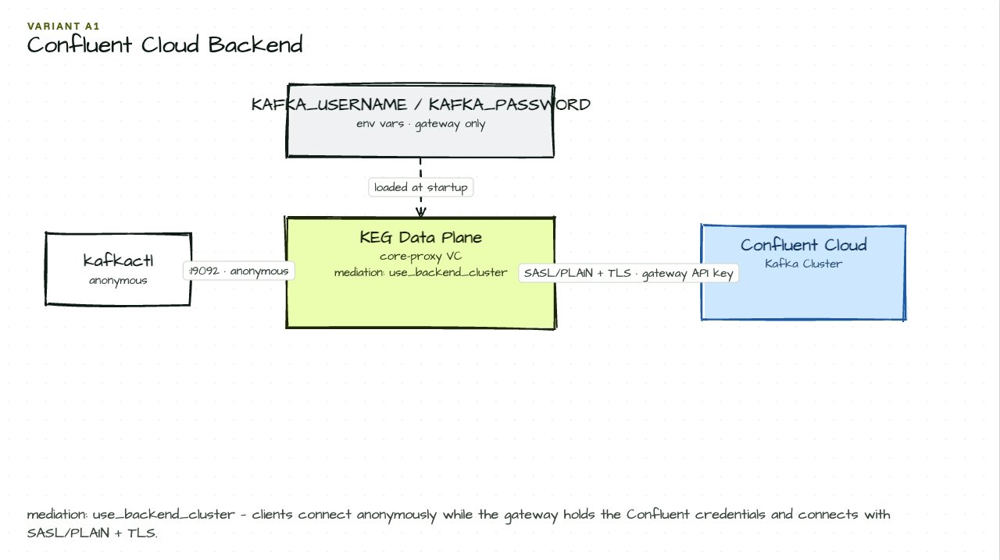

# Variant A1 — Confluent Cloud Backend

Northwind Financial's cloud team is evaluating Confluent Cloud as a managed Kafka backend. This variant swaps the local 3-broker cluster for a Confluent Cloud cluster — everything else (virtual clusters, namespaces, auth, ACLs) stays the same. Apply this instead of the numbered phases if you want to run the examples against Confluent Cloud.

## Setup Diagram



## What It Does

- Connects to a Confluent Cloud cluster with SASL/PLAIN + TLS
- Clients connect to the gateway anonymously — gateway holds the Confluent credentials
- `mediation: use_backend_cluster` — gateway uses its own backend credentials, not the client's

## How to Use

```bash
# Set your Confluent Cloud API key and secret:
export KAFKA_USERNAME=<your-confluent-cloud-api-key>
export KAFKA_PASSWORD=<your-confluent-cloud-api-secret>

# Update bootstrap_servers in kongctl/config.yaml with your Confluent Cloud endpoint:
# bootstrap_servers:
#   - <cluster-id>.us-east-1.aws.confluent.cloud:9092

# Apply (replaces any phase config):
kongctl apply -f kongctl/config.yaml

# Test the connection:
kafkactl config use-context core-proxy
kafkactl get topics
```

## Configuration Details

```yaml
backend_clusters:
  - ref: confluent-cloud
    authentication:
      type: sasl_plain
      sasl_plain:
        username: !env KAFKA_USERNAME
        password: !env KAFKA_PASSWORD
    bootstrap_servers:
      - <your-bootstrap-server>:9092
    tls:
      enabled: true
      insecure_skip_verify: true

virtual_clusters:
  - ref: confluent-proxy
    authentication:
      - type: anonymous
        mediation: use_backend_cluster
```

## Variant vs Phase

This is an **alternative** backend, not a cumulative phase. Apply it instead of the numbered phases to use Confluent Cloud as the broker. The virtual cluster, namespace isolation, auth, and ACL features from the phase examples all work identically against Confluent Cloud.

## See Also

- [Redpanda variant](../A2-redpanda/README.md)
- [Phase 1 — Basic Proxy](../01-basic-proxy/README.md)
- [Kong Event Gateway Documentation](https://docs.konghq.com/gateway/)
- [Confluent Cloud Documentation](https://docs.confluent.io/cloud/current/overview.html)
