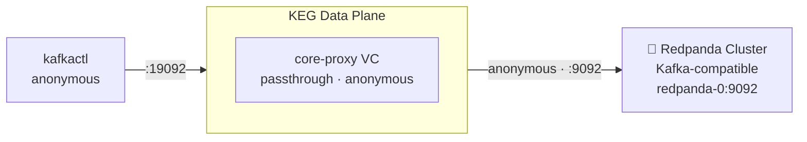

# Variant A2 — Redpanda Backend

This variant swaps the local Kafka cluster for a Redpanda cluster as the backend. Northwind Financial's platform team is evaluating Redpanda as a drop-in Kafka replacement. The gateway config is unchanged — only the backend cluster definition differs.

## Setup Diagram



## What It Does

- Replaces the local Kafka cluster with a Redpanda backend
- Anonymous authentication to Redpanda
- Flat passthrough virtual cluster — same topology as Phase 1 but against Redpanda
- All phase features (namespaces, auth, ACLs, encryption, schema validation) work identically

## How to Use

```bash
# Start Redpanda (separately or via its own docker-compose):
docker compose -f redpanda/docker-compose.yaml up -d

# Apply the variant config (replaces any phase config):
kongctl apply -f kongctl/config.yaml

# Test the connection:
kafkactl config use-context core-proxy
kafkactl get topics
```

## Configuration Details

```yaml
backend_clusters:
  - ref: redpanda-local
    authentication:
      type: anonymous
    bootstrap_servers:
      - redpanda-0:9092
    tls:
      enabled: false

virtual_clusters:
  - ref: redpanda-proxy
    authentication:
      - type: anonymous
```

## Variant vs Phase

This is an **alternative** backend, not a cumulative phase. Apply it instead of the numbered phases to use Redpanda as the broker. The full phase sequence (namespace isolation, auth termination, ACL enforcement, encryption, schema validation) works the same way against Redpanda.

## See Also

- [Confluent Cloud variant](../A1-confluent-cloud/README.md)
- [Phase 1 — Basic Proxy](../01-basic-proxy/README.md)
- [Kong Event Gateway Documentation](https://docs.konghq.com/gateway/)
- [Redpanda Documentation](https://docs.redpanda.com/)
